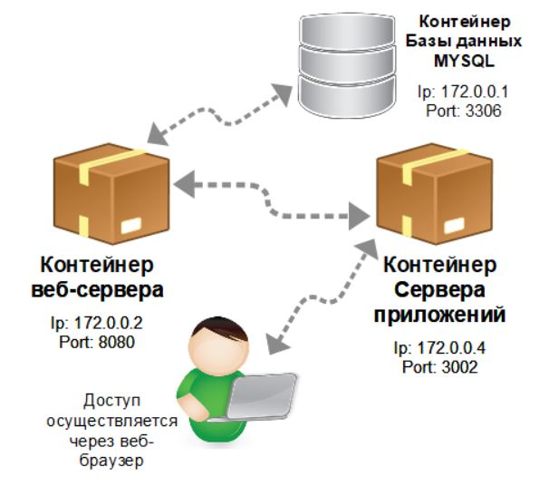
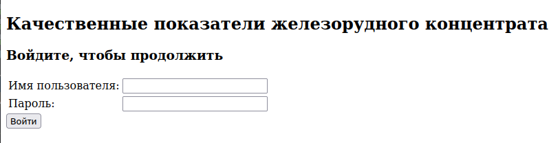
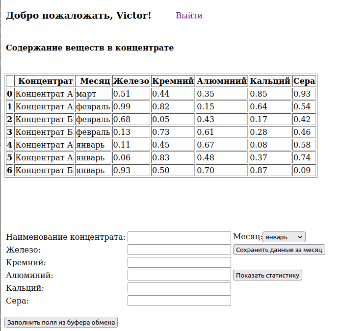
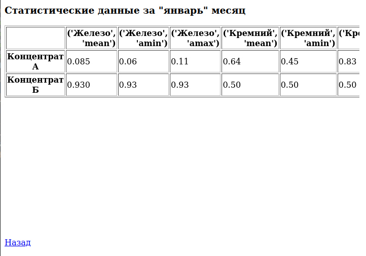

# Качественные показатели железорудного концентрата - серверная часть приложения.

В данном репозитории содержатся файлы, относящиеся к клиентской части приложения. Для её функционирования необходимо, 
чтобы на компьютере был развёрнут контейнер веб-сервера (второй репозиторий из этой серии) и контейнер базы данных MYSQL,
содержащий базу данных TestDB.

Схема приложения представлена на рисунке ниже:

## Перечень используемого ПО
- язык программирования Python
- docker
- Flask
- PyMySQL
- pandas и пр.

## Структура базы данных
База данных представлена двумя таблицами: *Users* и *lab_info*.
В первой хранятся данные о логинах и паролях пользователей.
Во второй хранятся данные о качественных показателях железорудных концентратов в привязке к user_id, а также с 
учётом месяца.
##### Поля таблицы Users
- *idUsers* - автоинкрементируемое поле
- *user_name* - имя пользователя
- *user_password* - пароль пользователя
##### Поля таблицы lab_info
- *lab_rec_id* - автоинкрементируемое поле
- *user_id* - код пользователя (внешний ключ)
- *concentrate_title* - наименование концентрата
- *month_title* - наименование месяца
- *ferum* - содержание железа
- *cremnium* - содержание кремния
- *aluminium* - содержание алюминия
- *calcium* - содержание кальция
- *sera* - содержание серы.

Для соединения с базой данных и выполнения запросов к ней, разработан
класс **ClsDb**. Этот класс содержит методы, функционал которых позволяет
находить пользователя в БД, вставлять и извлекать данные.

### Страница авторизации (из клиентского приложения)

При нажатии на кнопку **Войти**, осуществляется переход на страницу с отображением
информации о содержании веществ в железорудном концентрате (см. рис. ниже).

### Страница отображения качественных показателей (из клиентского приложения)

Таблица входит в блок div и при превышении её содержимого размеров этого блока, у блока div появятся полосы прокрутки.
При нажатии на кнопку **Показать статистику**, осуществляется загрузка страницы с результатом
запроса к серверу (см. рисунок ниже). При нажатии кнопки **Сохранить данные за месяц**,
осуществляется отправка запроса на сервер по добавлению данных в БД (передаётся выбранный
на странице месяц, наименование концентрата и качественные показатели оного), страница
обновляется и добавленная запись отображается в таблице.

### Страница отображения сводной информации по концентратам (из клиентского приложения)

Таблица с информацией по концентратам входит в блок div, и он имеет полосу прокрутки в нижней своей части.

## Перечень адресов для взаимодействия с веб-сервером со стороны клиента
- **Краткое описание приложения**: http://host:post/
- **Авторизация пользователя**: http://host:port/api/login
- **Вставка данных в БД**: http://host:post/api/insert_lab_data
- **Получение сводных данных из БД для вывода**: http://host:port/api/report
- **Отображение введённых пользователем данных**: http://host/port/api/display

## Авторизация - /api/login
#### Вход:
- login - имя пользователя для поиска в БД
- password - пароль пользователя для сравнения с хранящимся в БД.

#### Выход:
- если пользователь найден: его idUsers, при этом он также записывается в данные сессии
- если пользователь не нейден: {'error':'Не привильно введены логин или пароль'}

## Вставка данных в БД - /api/insert_lab_data
#### Вход:
- user_id - берётся из сессии. Если не найден, значит пользователь не авторизирован.
- dic_of_labs - перечень, состоящий из названий концентрата и месяца, а также
качественных показателей железорудного концентрала (float).

#### Выход:
- если пользователь не авторизирован: {'error': 'Авторизируйтесь для получения доступа к этому разделу.'}
- если пользователь авторизирован: результат запроса по выводу всех записей, введённых авторизированным 
пользователем в таблицу lab_info.

## Сводная информация - /api/report
#### Вход:
- user_id - берётся из сессии. Если не найден, значит пользователь не авторизирован.
- month - наименование месяца, за который нужно предоставить сводную информацию по
качественным показателям железорудного концентрата для авторизированного пользователя.

#### Выход:
- если пользователь не авторизирован: {'error': 'Авторизируйтесь для получения доступа к этому разделу.'}
- если пользователь авторизирован: результат запроса по выводу сводной информации (min, max, mean)
по всем качественным показателям железорудных концентратов, за определённый
авторизированным пользователем месяц.

## Вся информация - /api/display
#### Вход:
- user_id - берётся из сессии. Если не найден, значит пользователь не авторизирован.

#### Выход:
- если пользователь не авторизирован: {'error': 'Авторизируйтесь для получения доступа к этому разделу.'}
- если пользователь авторизирован: результат запроса по выводу всех качественных
показателей железорудных концентратов, введённых авторизированным пользователем
  (без учёта месяца).

